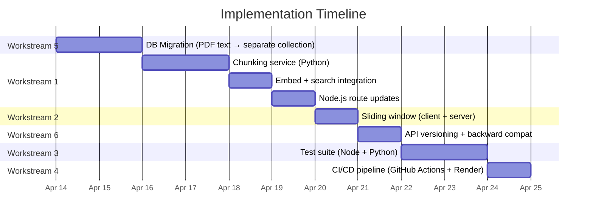

# PdfChat — Phase 2: Performance, Testing & DevOps

The "Remaining Improvements" from the Phase 1 walkthrough, now broken down into an actionable engineering plan across 6 workstreams.

---

## Context & Baseline

Phase 1 (completed by Claude Opus) delivered security fixes, modular architecture, Docker support, and a restructured codebase. The following items were explicitly deferred:

| # | Item | Current State |
|---|------|---------------|
| 1 | PDF chunking + semantic search | Full PDF text (`pdfData.text`) is sent with every `/ask-target` call — ~128K token budget consumed per question |
| 2 | Sliding window for chat history | `chatHistory` array in [index.js](file:///c:/Users/Amey%20Sawant/AMEY/MERN/Node/PdfChat/public/javascripts/index.js#L4) grows unbounded in the browser |
| 3 | Unit/integration tests | Zero test files across both Node and Python |
| 4 | CI/CD pipeline | No GitHub Actions or automated deployment |
| 5 | PDF text → separate collection | `pdfData.text` is stored inside the user document (hits MongoDB 16MB limit) |
| 6 | API versioning | Routes are unprefixed (`/ask`, `/upload`, `/chat`) |

---

## Decisions Made

| Decision | Resolution |
|----------|-----------|
| Embedding model | Local `all-MiniLM-L6-v2` (384-dim) — already in `requirements.txt`, no API cost |
| Test frameworks | Jest + Supertest (Node.js), pytest (Python) — professional, free, industry standard |
| Deployment target | **Render** — CI/CD pipeline with deploy hook on merge to `main` |
| API versioning | Backward-compatibility shim included — old routes redirect to `/api/v1/` until next major version |
| Database | **Stay with MongoDB** (see analysis below) |

---

## Database Analysis: Should We Keep MongoDB?

> [!NOTE]
> **TL;DR — Yes, stay with MongoDB Atlas.** It's the best fit for this project given the cost, migration effort, and free tier permanence.

### Free Tier Comparison

| Provider | Type | Free Storage | Expiry | Gotchas |
|----------|------|:------------:|--------|---------|
| **MongoDB Atlas M0** | NoSQL | **512 MB** | **Never** ✅ | 100 ops/sec, shared CPU, no auto-backups |
| Neon | PostgreSQL | 500 MB | Never | 100 CU-hours/month, scale-to-zero (cold starts) |
| Supabase | PostgreSQL | 500 MB | **Pauses after 1 week idle** ⚠️ | 2 projects max, no backups |
| Render PostgreSQL | PostgreSQL | 1 GB | **Expires after 30 days** ❌ | Then $7/month minimum |

### Why Stay With MongoDB

1. **Free tier is permanent** — Atlas M0 never expires, never pauses. Supabase kills your project after 1 week of no traffic. Render deletes the DB after 30 days.

2. **Migration cost is massive** — Switching to PostgreSQL means rewriting:
   - All Mongoose schemas in `dbmodels/user.js` → Sequelize/Prisma models
   - Every query in `routes/chat.js` and `routes/auth.js` (25+ Mongoose calls)
   - The migration script in `server.js`
   - Docker compose MongoDB service → PostgreSQL
   - This adds **5–7 days of pure rewrite work** with high regression risk

3. **Storage is equivalent** — All providers offer ~500MB free. MongoDB isn't worse here.

4. **Document model is natural** for this app — PDF sessions with nested interactions map cleanly to documents. PostgreSQL would need joins or JSONB workarounds.

### Storage Optimization Strategy (staying within 512MB)

The real concern is storage. Here's how we make 512MB go far:

| Strategy | Savings |
|----------|---------|
| **Don't store full text + chunks** — once chunked, drop `text` field (chunks ARE the text) | ~40% per PDF |
| **Limit sessions per user** — cap at 20 active sessions | Prevents unbounded growth |
| **TTL index on stale sessions** — auto-delete sessions inactive >90 days | Passive cleanup |
| **Compress embeddings** — store as base64 binary instead of float arrays | ~60% on embedding field |
| **User can delete sessions** — already has a rename feature, add a delete button | User-driven cleanup |

**Estimated storage per session**: ~25KB (chunks + compressed embeddings + meta) vs. current ~50-200KB (full text + meta). A user with 20 sessions uses ~500KB. The free tier supports **~1,000 users** at this rate.

> [!TIP]
> If you outgrow 512MB, MongoDB Atlas M2 is only **$9/month** for 2GB — and at that point you likely have enough users to justify the cost.

---

## Proposed Changes

### Workstream 1 — PDF Text Chunking + Semantic Search

**Goal**: Instead of sending the full PDF text (~50K–200K chars) with every question, split it into chunks, embed them, and send only the top-K relevant chunks to the LLM. This cuts token usage by **~70–90%**.

#### Architecture

```
Upload Flow:
  PDF → pdfplumber → raw text → chunk (512 tokens, 50 overlap) 
                                → embed (all-MiniLM-L6-v2)
                                → store chunks[] + embeddings in MongoDB (PdfContent collection)

Ask Flow:
  question → embed question → cosine similarity vs chunk embeddings
           → top-5 chunks → send to Groq with question + chat history
```

#### [NEW] `services/chunking.py`

- Standalone module for text chunking and embedding logic
- `ChunkingService` class:
  - `chunk_text(text, chunk_size=512, overlap=50)` → list of `{text, start_idx, end_idx}`
  - `embed_chunks(chunks)` → numpy array of embeddings using `SentenceTransformer('all-MiniLM-L6-v2')`
  - `semantic_search(query, chunk_embeddings, chunks, top_k=5)` → top-K relevant chunks
- `encode_embeddings()` / `decode_embeddings()` helpers for MongoDB storage (numpy ↔ base64)
- Separates ML concerns from Flask routing

#### [MODIFY] [deepseek_server.py](file:///c:/Users/Amey%20Sawant/AMEY/MERN/Node/PdfChat/deepseek_server.py)

- Import `ChunkingService` from `services/chunking.py`
- Modify `/process` to return `chunks[]` and `embeddings` (base64-encoded) alongside `text` and `meta_info`
- Modify `/ask-target` to:
  - Accept `chunks` + `embeddings` instead of full `pdfData.text`
  - Perform semantic search to find relevant chunks
  - Build a focused context from top-5 chunks only
  - Fall back to truncated full text if no embeddings exist (backward compatibility with old sessions)

#### [MODIFY] [routes/chat.js](file:///c:/Users/Amey%20Sawant/AMEY/MERN/Node/PdfChat/routes/chat.js)

- `/upload` route: store `chunks` and `embeddings` returned from Python server into `PdfContent` collection
- `/ask/:sessionId` route: fetch chunks/embeddings from `PdfContent` and send to Python `/ask-target` instead of full `pdfData.text`
- Both routes maintain backward compatibility with sessions that only have `pdfData.text`

---

### Workstream 2 — Sliding Window for Chat History

**Goal**: Cap the `chatHistory` array in the browser to the most recent N exchanges, preventing unbounded memory growth and keeping API payloads within the `tokenLimits.chatHistory` budget.

#### [MODIFY] [public/javascripts/index.js](file:///c:/Users/Amey%20Sawant/AMEY/MERN/Node/PdfChat/public/javascripts/index.js)

- Add `MAX_HISTORY_PAIRS = 10` constant (10 Q&A pairs = 20 messages)
- After pushing to `chatHistory` (line ~395-396), trim oldest entries:
  ```javascript
  if (chatHistory.length > MAX_HISTORY_PAIRS * 2) {
    chatHistory = chatHistory.slice(-MAX_HISTORY_PAIRS * 2);
  }
  ```
- Add a character-budget check against `tokenLimits.chatHistory` (30,720 chars) before sending — truncate from the oldest end if over budget
- Display a subtle indicator when history has been trimmed (e.g., "Showing last 10 exchanges")

#### [MODIFY] [routes/chat.js](file:///c:/Users/Amey%20Sawant/AMEY/MERN/Node/PdfChat/routes/chat.js)

- Server-side validation: clamp incoming `chatHistory` to max 20 messages before forwarding to Python
- Log a warning if client sends more than expected

---

### Workstream 3 — Unit & Integration Tests

**Goal**: Establish a test suite covering auth, chat, upload, and Python API routes.

#### Node.js Tests

#### [NEW] `tests/setup.js`

- Jest global setup: mock MongoDB via `mongodb-memory-server`, configure test `.env`

#### [NEW] `tests/unit/auth.test.js`

- `POST /create-user` — success, duplicate email (409), missing fields (422)
- `POST /verify-login` — success, wrong password (401), missing email (401)
- `GET /logout` — clears cookie

#### [NEW] `tests/unit/validators.test.js`

- Validate email format rejection, password length, question length limits

#### [NEW] `tests/integration/chat.test.js`

- Full flow: signup → upload PDF → ask question → verify response
- Upload validation: reject non-PDF, reject >10MB
- Session management: rename session, load session by ID

#### [NEW] `tests/integration/api.test.js`

- Health check endpoint returns 200
- Rate limiter triggers after threshold
- Auth middleware blocks unauthorized access

#### [MODIFY] [package.json](file:///c:/Users/Amey%20Sawant/AMEY/MERN/Node/PdfChat/package.json)

- Add scripts: `"test": "jest --forceExit --detectOpenHandles"`, `"test:coverage": "jest --coverage"`
- Add devDependencies: `jest`, `supertest`, `mongodb-memory-server`
- Add Jest config section

#### Python Tests

#### [NEW] `tests/test_chunking.py`

- Test `chunk_text()` — correct chunk count, overlap, edge cases (empty text, single word)
- Test `embed_chunks()` — correct dimensions (384), consistent output
- Test `semantic_search()` — returns top-K, correct ordering

#### [NEW] `tests/test_routes.py`

- Test `/process` — valid PDF, missing file, invalid path
- Test `/ask` — valid question, empty question
- Test `/ask-target` — with chunks/embeddings, backward compat with raw text
- Test `/health` — returns 200

#### [NEW] `pytest.ini`

- Configure pytest: test discovery, markers, coverage settings

---

### Workstream 4 — CI/CD Pipeline (Render)

**Goal**: Automated testing, linting, and deployment on every push/PR to Render.

#### [NEW] `.github/workflows/ci.yml`

```yaml
name: CI
on: [push, pull_request]

jobs:
  node-tests:
    runs-on: ubuntu-latest
    services:
      mongodb:
        image: mongo:7
        ports: ['27017:27017']
    steps:
      - uses: actions/checkout@v4
      - uses: actions/setup-node@v4
        with: { node-version: '18' }
      - run: npm ci
      - run: npm test
      - run: npm audit --audit-level=high

  python-tests:
    runs-on: ubuntu-latest
    steps:
      - uses: actions/checkout@v4
      - uses: actions/setup-python@v5
        with: { python-version: '3.11' }
      - run: pip install -r requirements.txt
      - run: pip install pytest pytest-cov
      - run: pytest --cov=. tests/

  docker-build:
    runs-on: ubuntu-latest
    needs: [node-tests, python-tests]
    steps:
      - uses: actions/checkout@v4
      - run: docker compose build
```

#### [NEW] `.github/workflows/deploy.yml`

```yaml
name: Deploy to Render
on:
  push:
    branches: [main]

jobs:
  deploy:
    runs-on: ubuntu-latest
    needs: []  # Runs after CI passes (via branch protection rules)
    steps:
      - name: Trigger Render Deploy
        run: curl -X POST "${{ secrets.RENDER_DEPLOY_HOOK_URL }}"
```

- Requires adding `RENDER_DEPLOY_HOOK_URL` as a GitHub Actions secret
- Render deploy hook URL is found in Render Dashboard → Service → Settings → Deploy Hook

#### [NEW] `.github/dependabot.yml`

- Weekly dependency update checks for npm and pip

---

### Workstream 5 — Migrate PDF Text to Separate Collection

**Goal**: Move `pdfData.text` (and chunked data) out of the user document to avoid MongoDB's 16MB document size limit and optimize storage.

#### Current Schema Problem

```
User Document (~16MB limit)
├── fullName, email, password
└── session[] ← Array of sessions, EACH containing full PDF text
    ├── session[0].pdfData.text  ← Could be 500KB+
    ├── session[1].pdfData.text  ← Could be 500KB+
    └── ...  (a user with 20+ large PDFs WILL hit the 16MB limit)
```

#### New Schema Design

```
User Document (stays small, <1MB)
├── fullName, email, password
└── session[]
    ├── session[0].sessionId, meta_info, interaction[], pdfContent: ObjectId
    └── ...

PdfContent Document (new collection, one per session)
├── _id: ObjectId
├── sessionId: String (indexed, unique)
├── userId: ObjectId (ref to User, indexed)
├── text: String (kept for backward compat, dropped after chunking)
├── chunks: [{ text, startIdx, endIdx }]
├── embeddings: String (base64-encoded numpy array, compressed)
└── createdAt, updatedAt
```

#### Storage Optimization Built-in

- After chunking: `text` field is **dropped** from `PdfContent` (chunks contain the same data, split up)
- Embeddings stored as base64 binary (60% smaller than JSON float arrays)
- TTL index: sessions inactive >90 days auto-deleted
- User session cap: max 20 active sessions per user

#### [NEW] `dbmodels/pdfContent.js`

- Mongoose model for the `pdfcontents` collection
- Schema: `{ sessionId, userId, text, chunks, embeddings, createdAt, updatedAt }`
- Indexes: `sessionId` (unique), `userId`, TTL on `updatedAt`

#### [MODIFY] [dbmodels/user.js](file:///c:/Users/Amey%20Sawant/AMEY/MERN/Node/PdfChat/dbmodels/user.js)

- Replace `pdfData.text` in session schema with `pdfContent: { type: mongoose.Schema.Types.ObjectId, ref: 'PdfContent' }`
- Keep `pdfData.meta_info` in the session (small, needed for sidebar rendering without extra queries)

#### [NEW] `scripts/migrate-pdf-text.js`

- One-time migration script:
  1. Iterate all users and their sessions
  2. For each session with `pdfData.text`, create a `PdfContent` document
  3. Update the session to reference the new document via ObjectId
  4. Remove `pdfData.text` from the user document (after verification)
  5. Verify migration integrity: count check + random spot checks
- Runs with: `node scripts/migrate-pdf-text.js`
- Includes `--dry-run` flag for safety (shows what would change without writing)
- Includes rollback instructions in case of failure

#### [MODIFY] [routes/chat.js](file:///c:/Users/Amey%20Sawant/AMEY/MERN/Node/PdfChat/routes/chat.js)

- `/upload`: Create `PdfContent` document, store only `ObjectId` reference in session
- `/ask/:sessionId`: Fetch PDF content via `PdfContent.findOne({ sessionId })` instead of pulling from user document
- `/chat/:sessionId`: No change needed (only uses `meta_info`, which stays in user doc)

#### [MODIFY] [server.js](file:///c:/Users/Amey%20Sawant/AMEY/MERN/Node/PdfChat/server.js)

- Update `migrateSessions()` to handle both old (embedded text) and new (ObjectId ref) formats gracefully

---

### Workstream 6 — API Versioning

**Goal**: Prefix all data API routes with `/api/v1/` to enable future non-breaking API evolution. Old routes remain functional via redirect shim.

#### Route Mapping

| Current Route | New Route | Type | Backward Compat |
|---------------|-----------|------|:---:|
| `POST /ask` | `POST /api/v1/ask` | API | 308 redirect |
| `POST /ask/:sessionId` | `POST /api/v1/ask/:sessionId` | API | 308 redirect |
| `POST /upload` | `POST /api/v1/upload` | API | 308 redirect |
| `POST /rename/:sessionId` | `POST /api/v1/rename/:sessionId` | API | 308 redirect |
| `POST /create-user` | `POST /api/v1/auth/create-user` | API | 308 redirect |
| `POST /verify-login` | `POST /api/v1/auth/verify-login` | API | 308 redirect |
| `GET /logout` | `GET /api/v1/auth/logout` | API | 308 redirect |
| `GET /chat` | `GET /chat` | **Page** | — |
| `GET /chat/:sessionId` | `GET /chat/:sessionId` | **Page** | — |
| `GET /login/:status` | `GET /login/:status` | **Page** | — |
| `GET /health` | `GET /health` | **Infra** | — |

> [!NOTE]
> Page routes (serving HTML) and infrastructure routes (`/health`) do **not** get versioned — only data API endpoints. The backward-compat `308` redirects preserve the method+body, so old clients keep working.

#### [MODIFY] [routes/auth.js](file:///c:/Users/Amey%20Sawant/AMEY/MERN/Node/PdfChat/routes/auth.js)

- Split into page routes (login pages) and API routes (create-user, verify-login, logout)
- API routes mounted under `/api/v1/auth/`

#### [MODIFY] [routes/chat.js](file:///c:/Users/Amey%20Sawant/AMEY/MERN/Node/PdfChat/routes/chat.js)

- Split into:
  - **Page routes**: `/chat`, `/chat/:sessionId` → mounted at `/`
  - **API routes**: `/ask`, `/ask/:sessionId`, `/upload`, `/rename/:sessionId` → mounted at `/api/v1`

#### [NEW] `routes/legacy.js`

- Backward-compatibility shim: catches old routes and issues `308 Permanent Redirect` to versioned equivalents
- Logs deprecation warnings to help track migration progress
- Will be removed in next major version

#### [MODIFY] [server.js](file:///c:/Users/Amey%20Sawant/AMEY/MERN/Node/PdfChat/server.js)

```javascript
app.use("/", pageRoutes);               // GET /chat, GET /login
app.use("/api/v1", apiRoutes);          // POST /api/v1/ask, etc.
app.use("/api/v1/auth", authApiRoutes); // POST /api/v1/auth/create-user, etc.
app.use("/", legacyRedirects);          // POST /ask → 308 → /api/v1/ask
```

#### [MODIFY] [public/javascripts/index.js](file:///c:/Users/Amey%20Sawant/AMEY/MERN/Node/PdfChat/public/javascripts/index.js)

- Update all `fetch()` calls to use `/api/v1/` prefix:
  - `fetch('/ask/${sessionId}')` → `fetch('/api/v1/ask/${sessionId}')`
  - `fetch('/rename/${sessionId}')` → `fetch('/api/v1/rename/${sessionId}')`
  - `fetch('/upload')` remains → `fetch('/api/v1/upload')`

#### [MODIFY] [views/login.ejs](file:///c:/Users/Amey%20Sawant/AMEY/MERN/Node/PdfChat/views/login.ejs)

- Update fetch URLs in login/signup JS to `/api/v1/auth/create-user` and `/api/v1/auth/verify-login`

---

## Execution Order & Dependencies



**Rationale for order**:
1. **WS5 first** — The DB schema change is foundational; WS1 (chunking) builds on the new `PdfContent` collection
2. **WS1 after WS5** — Chunking writes to the new collection
3. **WS2 after WS1** — Sliding window can be tested with the new chunked context flow
4. **WS6 after WS2** — API versioning touches all routes, so do it after functional changes are stable
5. **WS3 after WS6** — Tests should validate the final route structure
6. **WS4 last** — CI/CD runs the tests, so tests must exist first

**Estimated total: ~10 days of focused work.**

---

## New Files Summary

| File | Purpose |
|------|---------|
| `services/chunking.py` | Text chunking + embedding logic (Python) |
| `dbmodels/pdfContent.js` | Mongoose model for separated PDF content |
| `scripts/migrate-pdf-text.js` | One-time data migration script |
| `routes/legacy.js` | Backward-compat 308 redirect shim |
| `tests/setup.js` | Jest test configuration |
| `tests/unit/auth.test.js` | Auth route unit tests |
| `tests/unit/validators.test.js` | Input validation tests |
| `tests/integration/chat.test.js` | Full-flow integration tests |
| `tests/integration/api.test.js` | API endpoint tests |
| `tests/test_chunking.py` | Python chunking/embedding tests |
| `tests/test_routes.py` | Python Flask route tests |
| `pytest.ini` | Python test configuration |
| `.github/workflows/ci.yml` | GitHub Actions CI pipeline |
| `.github/workflows/deploy.yml` | Render auto-deploy on merge to main |
| `.github/dependabot.yml` | Automated dependency updates |

---

## Verification Plan

### Automated Tests
- `npm test` — Jest + Supertest for all Node routes
- `pytest tests/` — Python chunking, embedding, and Flask route tests
- `npm audit --audit-level=high` — Security vulnerability check
- Docker build verification: `docker compose build` succeeds
- CI pipeline validates all of the above on every push

### Manual Verification
1. **Chunking quality**: Upload a 50+ page PDF, ask about page 30 — verify only relevant chunks retrieved (Python logs show chunk indices)
2. **Token savings**: Compare Groq API token usage before/after chunking
3. **History trimming**: 20+ message conversation, verify oldest messages drop from API payload but remain visible in UI
4. **Migration safety**: Run `node scripts/migrate-pdf-text.js --dry-run` first, verify counts, then run live
5. **API versioning**: Old `POST /ask` returns 308 redirect, new `POST /api/v1/ask` works directly
6. **CI pipeline**: Push a branch, verify GitHub Actions runs tests and reports pass/fail
7. **Storage check**: After migration, verify collection sizes in MongoDB Atlas dashboard
8. **Backward compat**: All existing sessions (pre-chunking) still work via fallback path
